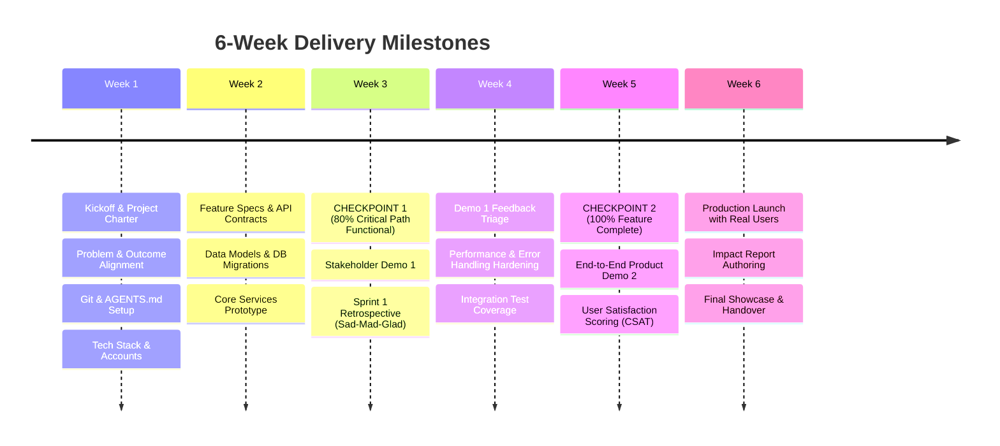

# MASTER PROJECT ROADMAP (6-WEEK ROADMAP)

> **Delivery Model**: 6-week cadence partitioned into 4 agile sprint iterations.

---

## 🗺️ Key Milestones & Critical Checkpoints

```mermaid
timeline
    title 6-Week Delivery Milestones
    Week 1 : Kickoff & Project Charter : Problem & Outcome Alignment : Git & AGENTS.md Setup : Tech Stack & Accounts
    Week 2 : Feature Specs & API Contracts : Data Models & DB Migrations : Core Services Prototype
    Week 3 : CHECKPOINT 1 (80% Critical Path Functional) : Stakeholder Demo 1 : Sprint 1 Retrospective (Sad-Mad-Glad)
    Week 4 : Demo 1 Feedback Triage : Performance & Error Handling Hardening : Integration Test Coverage
    Week 5 : CHECKPOINT 2 (100% Feature Complete) : End-to-End Product Demo 2 : User Satisfaction Scoring (CSAT)
    Week 6 : Production Launch with Real Users : Impact Report Authoring : Final Showcase & Handover
```
