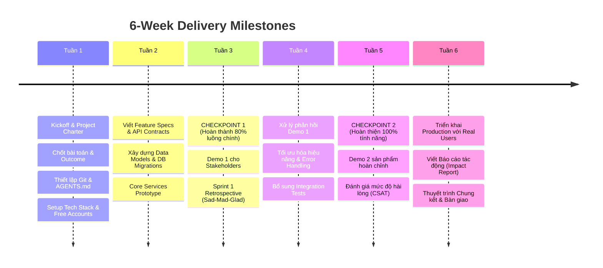

# LỘ TRÌNH DỰ ÁN TỔNG THỂ (6-WEEK ROADMAP)

> **Mô hình**: Khung 6 tuần chia thành 4 Sprint phát triển lặp nhanh (Agile).

---

## 🗺️ CÁC MỐC QUAN TRỌNG & CHECKPOINT SINH TỬ

```mermaid
timeline
    title 6-Week Delivery Milestones
    Tuần 1 : Kickoff & Project Charter : Chốt bài toán & Outcome : Thiết lập Git & AGENTS.md : Setup Tech Stack & Free Accounts
    Tuần 2 : Viết Feature Specs & API Contracts : Xây dựng Data Models & DB Migrations : Core Services Prototype
    Tuần 3 : CHECKPOINT 1 (Hoàn thành 80% luồng chính) : Demo 1 cho Stakeholders : Sprint 1 Retrospective (Sad-Mad-Glad)
    Tuần 4 : Xử lý phản hồi Demo 1 : Tối ưu hóa hiệu năng & Error Handling : Bổ sung Integration Tests
    Tuần 5 : CHECKPOINT 2 (Hoàn thiện 100% tính năng) : Demo 2 sản phẩm hoàn chỉnh : Đánh giá mức độ hài lòng (CSAT)
    Tuần 6 : Triển khai Production với Real Users : Viết Báo cáo tác động (Impact Report) : Thuyết trình Chung kết & Bàn giao
```
